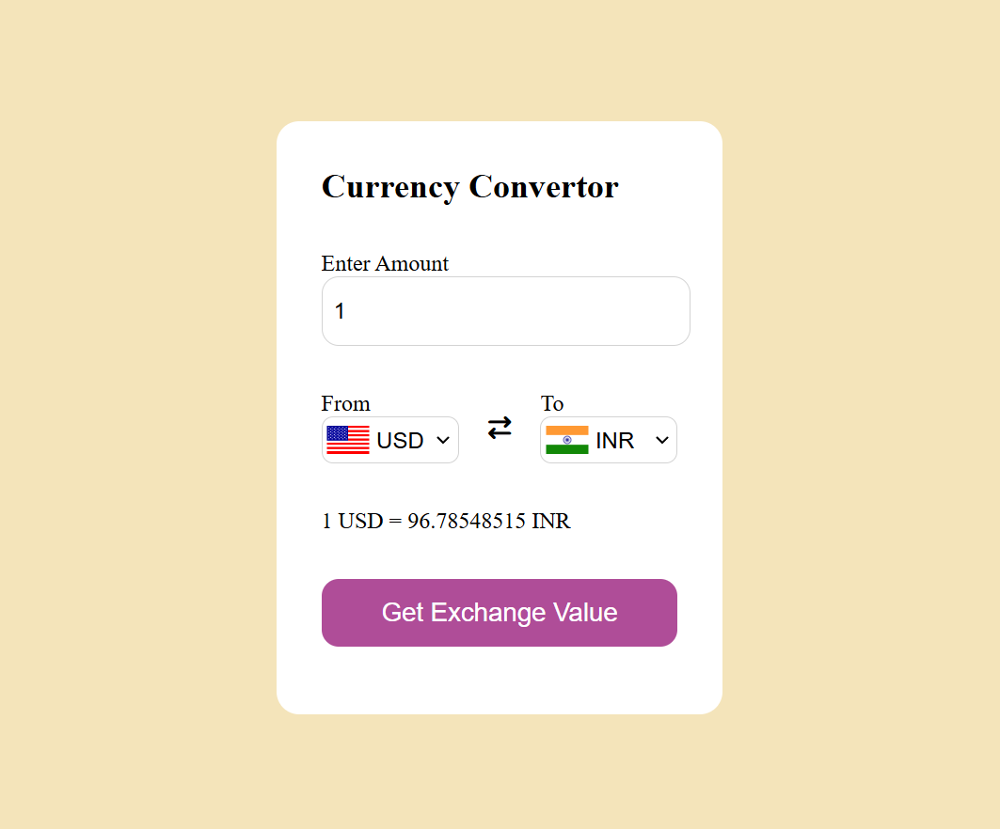

# 💱 Currency Converter

A simple and responsive Currency Converter web application built using **HTML, CSS, and JavaScript**. It allows users to convert currencies using real-time exchange rates and displays the corresponding country flags.

## 🚀 Features

- 🌍 Convert between multiple currencies
- 💹 Fetches real-time exchange rates using an API
- 🏳️ Displays country flags based on selected currencies
- 📱 Responsive and clean UI
- ⚡ Fast and easy to use

## 🛠️ Tech Stack

- HTML5
- CSS3
- JavaScript (ES6)
- Currency AP

## 📸 Screenshot

## 🌐 API Used

- Exchange Rates:
  https://latest.currency-api.pages.dev

## 📌 Future Improvements

- Swap currency button functionality
- Dark mode
- Currency conversion history
- Searchable currency dropdown
- Better error handling

## 👩‍💻 Author

**Ujjaini Das**

GitHub: https://github.com/ujjaini-das

---
